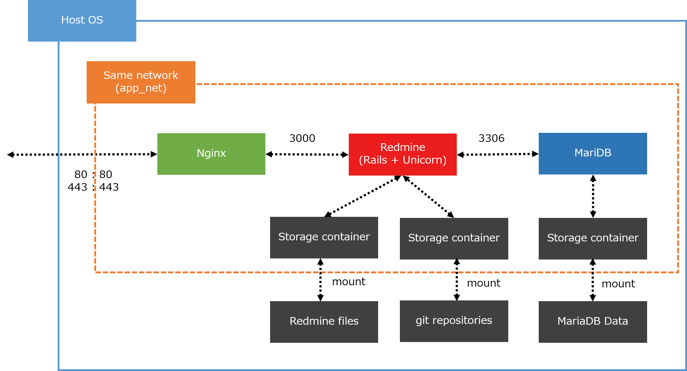

[](https://circleci.com/gh/YoshinoriN/docker-redmine-orchestration)

# 補足記事

このリポジトリの補足記事は[こちらです](https://yoshinorin.net/2017/01/04/redmine-based-on-nginx-unicorn-mariadb-using-by-docker-compose/)

# これは何？

Docker-composeで構築できるRedmineです。
公式のDocker Redmineもありますが、公式のRedmineは1コンテナ内で動作することと構成に納得いかない点があったため自作しました。

# 構成

* MariaDB 10.3.0
* Nginx 1.13.12 (無効にすることも可能です)
* Ruby 2.4.1
* Unicorn 5.4.0

# Docker公式のRedmineとの相違点

|-|公式|本リポジトリ|
|---|---|---|
|DB|MySQL|MariaDB|
|Webサーバー|-|Nginx (無効にすることも可能です)|
|Applicationサーバー|webrickもしくはpassenger|unicorn|

その他の相違点は確認していません。

# 動作要件

* Docker compose 1.6以上

# 概要




# デフォルトVCS

デフォルトでRedmineコンテナにgitをインストールするようにしています。併せて、Redmineの`configuration.yml`にも自動でgitを紐づけるように設定しています。

# インストールと実行

## インストール

`./redmine`ディレクトリ内にある`redmine_download.sh`を実行してください。

ダウンロード完了後は`./redmine/src/config`内の各種設定ファイルを任意の設定に変更してください。

## 実行

`docker-compose up`を実行してください。

```sh
docker-compose up
```

起動後は`http://ドメイン:3000`にアクセスしてください。Redmineのログイン画面が表示されます。

`docker-compose.yml`に`RAILS_MIGRATE`というキーが存在します。これは初回ビルド時にデータベースのマイグレートを行うためのものです。初回のビルド後はこちらの値を`0`に変更してください。

# 設定

## MariaDB

MariaDBそのものの設定に関しては`./mariadb/config/my.cnf`を変更することでコンテナ側に反映されます。
ビルド後も変更可能です。

ただし、ユーザーやパスワードはビルド時に`docker-compose.yml`で作成されます。

### 文字コード

MariaDBの文字コードは`utf8mb4`に設定しています。

### ユーザーとパスワード

`docker-compose.yml`の下記を変更することでユーザーとパスワードを変更することが可能です。

```yml
  mariadb:
    build: ./mariadb
    container_name: mariadb
    environment:
      MYSQL_ROOT_PASSWORD: mypass
      MYSQL_USER: redmine
      MYSQL_DATABASE: redmine
```

変更した場合はあわせて`./redmine/src/config/database.yml`も変更してください。初回のビルド後は`MYSQL_ROOT_PASSWORD`は削除可能です。

加えて下記も変更してください。下記はDocker composeで起動した際にMariaDBが先に起動するのを確認するためにpingを打っています。

```yml
  redmine:
    build: ./redmine
    container_name: redmine
    environment:
      RAILS_MIGRATE: 1
      PLUGINS_MIGRATE: 1
      DB_PING_USER: redmine
      DB_PING_USER_PASSWORD: redmine 
```

### MariaDBに直接接続したい場合

デフォルトの設定ではMariaDBには直接接続できません。
接続する場合は`docker-compose.yml`の`mariadb`キー内に下記を追記してください。

```yml
    ports:
      - "3306:3306"
```

## nginx

`./nginx/config/nginx.conf`を変更することでコンテナ側に反映されます。
ビルド後も変更可能です。

### 無効にする

既にWebサーバが存在する等の理由でnginxを無効にしたい場合は`docker-compose.yml`のnginx関連のコンテナをコメントアウトしてください。
そのうえで`docker-compose.yml`の`redmine`キー内にに下記を追記してください。

```yml
    ports:
      - "3000:3000"
```

### HTTPS

HTTPSを設定する場合は`./nginx/config/nginx.conf`と`docker-compose.yml`の2ファイルを修正する必要があります。
証明書はホストOS側に設置し、Nginxコンテナにマウントさせます。

まず、`./nginx/config/nginx.conf`内の下記コメントアウトを外したうえで、各パラメーターに適切な値と証明書のパスを設定してください。

```sh
server {
        #NOTE : for TLS connection.
        ssl on;
        ssl_prefer_server_ciphers on;
        ssl_protocols TLSv1.2;
        ssl_certificate <key's path in nginx container>;
        ssl_certificate_key <key's path in nginx container>;
```

次に`docker-compose.yml`の次の項目にホスト側の証明書のパスと前述の`nginx.conf`に記述したNginx側の証明書のパスを設定してください。

```yml
    #NOTE : TLS key's path for HTTPS
     - <host ssl_certificate key's path> : <nginx.conf ssl_certificate key's path>
     - <host ssl_certificate_key key's path> : <nginx.conf  ssl_certificate_key key's path>
```

後はRedmine側の管理画面でHTTPS通信に変更してください、

以上でHTTPSで通信できるはずです。

## Redmine

`./redmine/src/config`内の各設定ファイルを変更することでコンテナ側に反映されます。
ビルド後も変更可能です。

### Redmineプラグインをインストールする場合

`./redmine/src/plugins`内にpluginを配置してください。

その後は下記の`PLUGINS_MIGRATE`を`1`に設定してください。コンテナ起動と同時にプラグインのインストールがはじまります。

```yml
  redmine:
    build: ./redmine
    container_name: redmine
    environment:
      RAILS_MIGRATE: 1
      PLUGINS_MIGRATE: 1
      DB_PING_USER: root
      DB_PING_USER_PASSWORD: mypass 
```

なお、ユーザーが使用するプラグインを柔軟にインストールできるように、コンテナ起動時に都度インストールするようにしています。これにより、インストールのたびにイメージを再作成する手間を省いています。

# Unicornサーバ

`docker-compose.yml`の下記のディレクティブでUnicornサーバの設定を変更できます。

|名前|役割|デフォルト値|
|---|---|---|
|UNICORN_WORKER_PROCESS|ワーカープロセス数|2|
|UNICORN_TIMEOUT|タイムアウト|60|
|UNICORN_WOKER_KILLER_MEMORY_MIN|ワーカープロセス再起動の最低閾値（単位MB）|192|
|UNICORN_WOKER_KILLER_MEMORY_MAX|ワーカープロセス再起動の最大閾値（単位MB）|256|
|UNICORN_WOKER_KILLER_CHECK_CYCLE|ワーカープロセス再起動のチェックサイクル|16|
|UNICORN_WOKER_KILLER_VERBOSE|Unicorn worker killerのロギング|false|

unicorn-worker-killer については [unicorn-worker-killer](https://github.com/kzk/unicorn-worker-killer)のリポジトリを参照ください。

# タイムゾーン

コンテナのタイムゾーンを変更したい場合は下記のように`TZ`キーを追加してください。下記のサンプルだと東京にしています。

```yml
  mariadb-storage:
    build: ./storage/mariadb-storage
    container_name: mariadb-storage
    environment:
      TZ: Asia/Tokyo
    volumes:
     - ./storage/mariadb-storage/data:/var/lib/mysql
```

# git

下記のディレクトリにリポジトリを作成した場合にリポジトリをRedmine側のコンテナにマウントするように設定しています。

リポジトリは複数作成可能です。

```sh
./storage/git-storage/repositories/<your-repository>
```

Redmineコンテナ側のリポジトリのパスは下記のディレクトリ内になります。

```sh
/usr/src/git/<your-repository>
```

# バックアップ

`backup.sh`を実行することで`buckups`ディレクトリ内に「gitリポジトリ/Redmineのfile/MariaDBのデータベース一式」がtar形式で保存されます。

MariaDBに関しては現状データベースファイルが丸ごとバックアップされます。Redmineデータベースのみのバックアップスクリプトは作成予定です。

# その他の設定

その他設定変更したい場合は`docker-compose.yml`を変更してください。

# リポジトリの構成

```sh
.
├── backups
├── backup.sh
├── circle.yml
├── doc
│   ├── img
│   │   └── overview.png
│   ├── overview.pptx
│   └── README_JA.md
├── docker-compose.yml
├── images
├── LICENSE
├── logs
│   ├── nginx
│   └── redmine
├── mariadb
│   ├── config
│   │   └── my.cnf
│   └── Dockerfile
├── nginx
│   ├── config
│   │   └── nginx.conf
│   └── Dockerfile
├── README.md
├── redmine
│   ├── docker-entrypoint.sh
│   ├── Dockerfile
│   ├── Gemfile
│   ├── README.md
│   ├── redmine_download.sh
│   └── src
│       └── config
│           ├── configuration.yml
│           ├── database.yml
│           └── unicorn.rb
└── storage
    ├── git-storage
    │   ├── Dockerfile
    │   └── repositories
    │       └── README.md
    ├── mariadb-storage
    │   ├── data
    │   └── Dockerfile
    └── redmine-files
        ├── Dockerfile
        └── files
```
